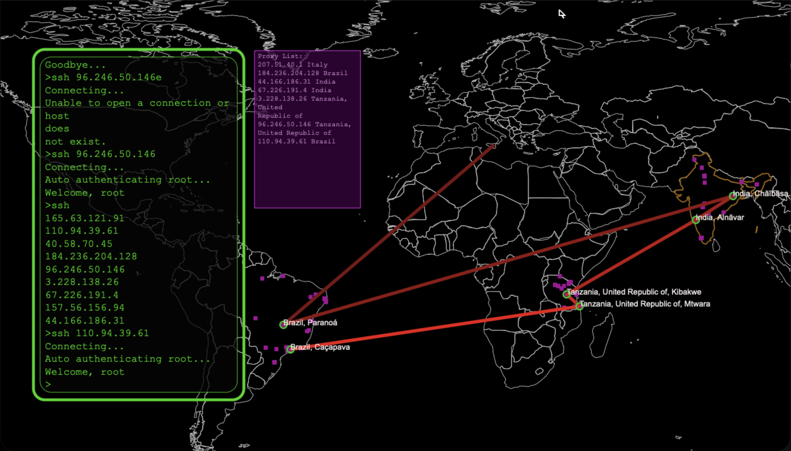
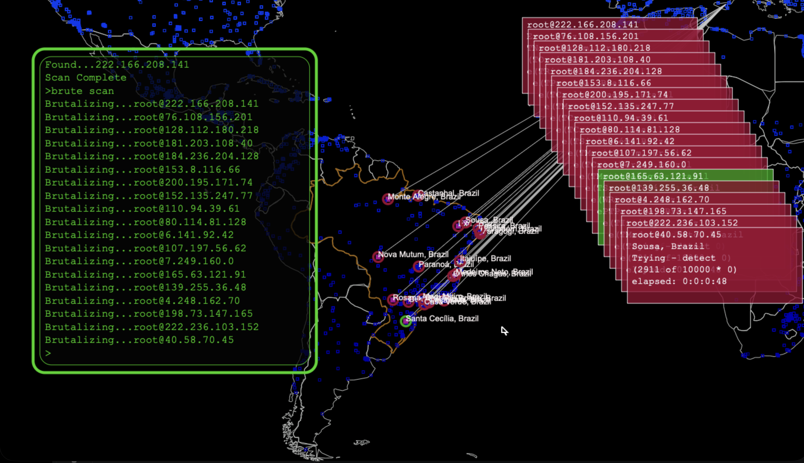
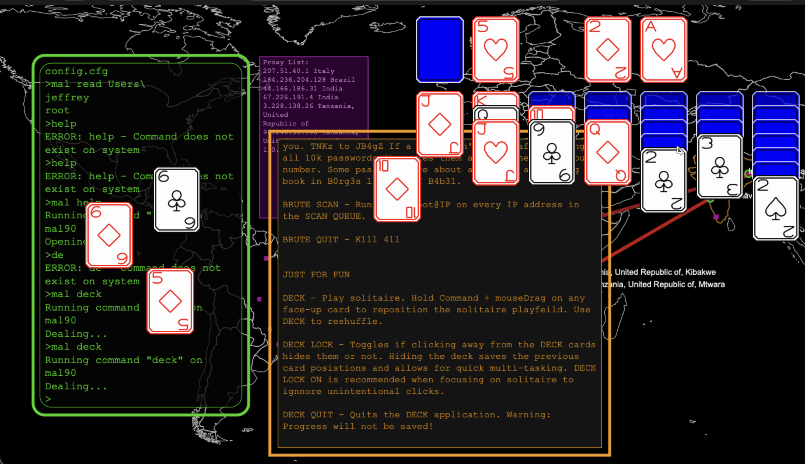

# Hacker2000

Retro hacking simulation videogame with vector graphics.

IMPORTANT NOTICE TO THE PLAYER: Despite the fact this is a browser-based game, the simulated computers are created locally on your device. The pretend tools in this videogame, such as SSH, are NOT connecting over the internet to real computers. The DTMF tones from DIAL are NOT makeing real world phone calls. That said, this game does make real network connections for the command AUDIO, which streams music from real urls over the real world internet. Streaming Jungle music (and whatever URLs you add to the playlist) is the only network connection this game will make.

</img>
</img>
</img>
</img>

# Early pre-alpha version:

[Click Here](https://doomlazer.github.io/Hacker2000)
